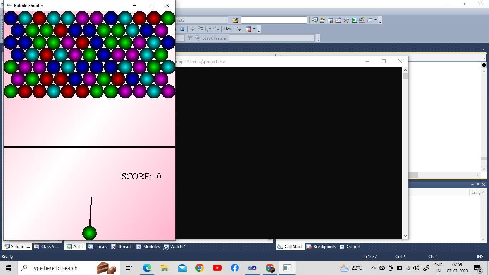

# Bubble-Shooter 

The implementation of ‘BUBBLE SHOOTER’ using a set of OpenGL functions. 
The project developed here takes the mouse clicks as inputs. We have used many built 
in functions such as light function, color function, material function etc. 
All these functions take some numerical values which will be initialized before they 
are used. The objects are drawn by using GLUT functions.

## ScreenShot

